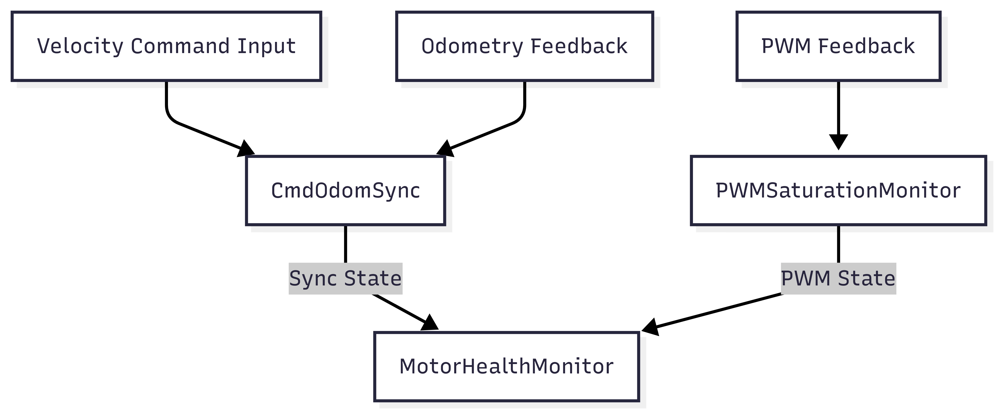

Here’s your complete, polished `README.md` with everything included in one file — structure, diagrams (in Mermaid), simulation instructions, license section, and contribution guidelines.

---

````markdown
# Motor Health Monitor

> A modular, C++17-based toolkit for motor diagnostics and command/odometry compliance monitoring. Hardware-agnostic and simulation-ready.


---

## Table of Contents

- [Features](#features)
- [Architecture](#architecture)
- [Simulation Scenarios](#simulation-scenarios)
- [Getting Started](#getting-started)
- [Build Instructions](#build-instructions)
- [Run the Simulation](#run-the-simulation)
- [Project Structure](#project-structure)
- [License](#license)
- [Contributing](#contributing)
- [Contact](#contact)

---

## Features

- ✅ **Command/Odometry Synchronization** with `CmdOdomSync`
- ⚙️ **PWM Saturation Detection** using `PWMSaturationMonitor`
- 🔌 Easily extendable to hardware drivers or simulated environments
- 🧩 ROS-independent, pure C++17
- 🧪 Ready for CI testing and modular integration

---

## Architecture



---

## Simulation Scenarios

This project includes built-in test simulations that verify:

* **CmdOdomSync** state transitions:
  `SYNCED`, `UNSYNCED`, and `INDETERMINATE`
* **PWM saturation** detection logic with duration tracking

These are implemented in `main.cpp`, and require **no hardware** to run.

---

## Getting Started

### 🔧 Requirements

* C++17
* CMake ≥ 3.10
* Linux / WSL (tested)

---

## Build Instructions

```bash
git clone https://github.com/your-username/motor_health_monitor.git
cd motor_health_monitor
mkdir build && cd build
cmake ..
make
```

---

## Run the Simulation

```bash
./motor_health_monitor
```

This will:

* Generate synthetic `/cmd_vel` and `/odom` signals
* Simulate a mismatch (non-compliance)
* Trigger saturation conditions and state transitions

The simulation runs entirely from `main.cpp`.

---

## Project Structure

```
motor_health_monitor/
├── include/
│   └── cmd_odom_sync/
│       ├── CmdOdomSync.hpp
│       └── PWMSaturationMonitor.hpp
├── src/
│   ├── CmdOdomSync.cpp
│   ├── PWMSaturationMonitor.cpp
│   └── main.cpp
├── build/
├── CMakeLists.txt
├── LICENSE
└── README.md
```

---

## License

This project is licensed under the MIT License. See the [LICENSE](LICENSE) file for details.

---

## Contributing

Contributions are welcome! Feel free to:

* Open issues for bug reports or feature ideas
* Submit pull requests with enhancements or test cases
* Fork and adapt the project for your own applications

---

## Contact

Have questions or ideas? Open an issue or reach out via GitHub.

---


