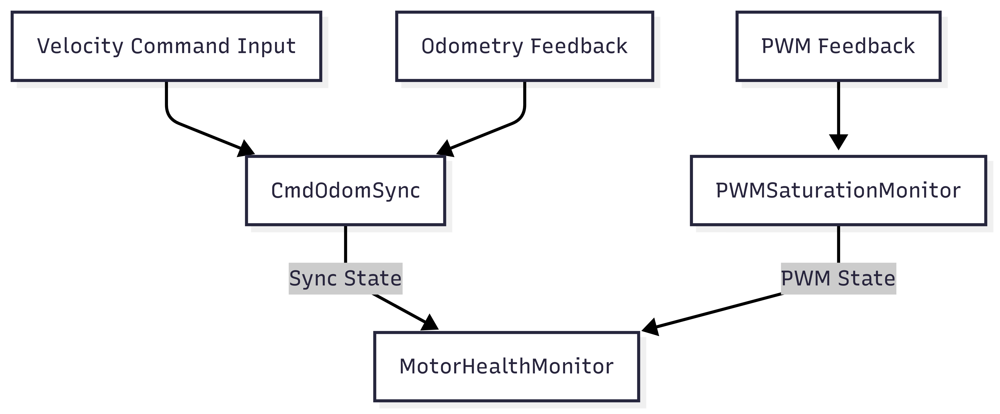

# Motor Health Monitor

A ROS 2 C++17 package for monitoring motor health and detecting faults by analyzing the synchronization between command velocities and odometry feedback.


## Features

- ✅ **Command/Odometry Synchronization Detection** - Monitors sync state between commanded and actual velocities
- 🔍 **Motor Fault Detection** - Detects motor faults when velocity error exceeds threshold for specified duration
- 🧩 **ROS 2 Component Architecture** - Built as a composable node using `rclcpp_components`
- 🧪 **Comprehensive Unit Tests** - Full test coverage with Google Test
- 🔒 **Memory Safe & Thread Safe** - Follows modern C++17 best practices with proper ownership semantics
- 📊 **Diagnostic Integration** - Publishes diagnostic messages compatible with ROS 2 diagnostic aggregator

## Architecture



The package consists of several key components:

- **MotorHealthNode** - Main ROS 2 node that subscribes to `cmd_vel` and `odom` topics
- **CmdOdomSync** - Detects synchronization state between command and odometry streams
- **MotorFaultDetector** - Monitors motor controller feedback and detects faults based on configurable thresholds
- **VelocityDiffController** - Computes velocity difference for fault detection

## Requirements

- ROS 2 (tested with Jazzy)
- C++17 compiler
- CMake ≥ 3.8
- ament_cmake build system

## Build Instructions

### Standard Build

```bash
cd /path/to/your/ros2_ws/src
git clone https://github.com/SamuelOgunniyi/motor_health_monitor.git
cd /path/to/your/ros2_ws
colcon build --packages-select motor_health_monitor
source install/setup.bash
```

### Build with Tests

```bash
colcon build --cmake-args -DBUILD_TESTING=ON --packages-select motor_health_monitor
```

## Running

### Launch the Node

```bash
ros2 launch motor_health_monitor motor_health.launch.py
```

### Run as Component

```bash
ros2 run rclcpp_components component_container
ros2 component load /ComponentManager motor_health_monitor motor_health_monitor::MotorHealthNode
```

### View Diagnostics

```bash
ros2 topic echo /diagnostics
```

## Configuration

The node supports the following ROS 2 parameters:

- `sync_tolerance` (double, default: 0.05) - Tolerance for command/odometry synchronization
- `update_rate_ms` (int, default: 100) - Update rate in milliseconds
- `fault_limit` (double, default: 0.95) - Velocity difference threshold for fault detection
- `fault_duration` (double, default: 0.2) - Duration in seconds before fault is triggered

Example configuration file (`config/motor_health.yaml`):

```yaml
motor_health_monitor:
  ros__parameters:
    sync_tolerance: 0.05
    update_rate_ms: 100
    fault_limit: 0.95
    fault_duration: 0.2
```

## Testing

The package includes comprehensive unit tests:

```bash
# Build with tests
colcon build --cmake-args -DBUILD_TESTING=ON --packages-select motor_health_monitor

# Run tests
colcon test --packages-select motor_health_monitor

# View test results
colcon test-result --verbose
```

### Test Coverage

- **CmdOdomSync** (10 tests) - Synchronization state detection, boundary conditions, NaN/Inf handling
- **VelocityDiffController** (12 tests) - Velocity difference calculation, edge cases
- **MotorFaultDetector** (11 tests) - Fault detection logic, timer behavior, configuration updates

Total: **33 tests** covering normal operation, edge cases, and error conditions.

## Project Structure

```
motor_health_monitor/
├── include/
│   └── motor_health_monitor/
│       ├── cmd_odom_sync.hpp          # Command/odometry sync detection
│       ├── motor_controller.hpp        # Motor controller interface
│       ├── motor_fault_detector.hpp   # Fault detection logic
│       ├── motor_health_node.hpp      # Main ROS 2 node
│       ├── robot_drive_motor_controller.hpp  # Example controller implementation
│       └── velocity_diff_controller.hpp      # Velocity difference wrapper
├── src/
│   ├── cmd_odom_sync.cpp
│   └── motor_health_node.cpp
├── test/
│   ├── mock_motor_controller.hpp      # Mock for testing
│   ├── test_cmd_odom_sync.cpp
│   ├── test_motor_fault_detector.cpp
│   └── test_velocity_diff_controller.cpp
├── launch/
│   └── motor_health.launch.py
├── config/
│   └── motor_health.yaml
├── CMakeLists.txt
├── package.xml
└── README.md
```

## Topics

### Subscribed Topics

- `/cmd_vel` (`geometry_msgs/msg/Twist`) - Commanded velocity
- `/odom` (`nav_msgs/msg/Odometry`) - Odometry feedback

### Published Topics

- `/diagnostics` (`diagnostic_msgs/msg/DiagnosticArray`) - Motor health diagnostics

## Code Quality

The codebase follows modern C++17 best practices:

- **Rule of 5/0** - Explicit copy/move semantics
- **Thread Safety** - Mutex protection for shared data accessed from callbacks
- **Exception Safety** - RAII patterns with `std::lock_guard`
- **Const Correctness** - Proper use of `const` and `noexcept`
- **Memory Safety** - Smart pointers, no raw pointers, clear ownership

## License

This project is licensed under the Apache License 2.0. See the [LICENSE](LICENSE) file for details.

## Contributing

Contributions are welcome! Please:

1. Fork the repository
2. Create a feature branch
3. Add tests for new functionality
4. Ensure all tests pass
5. Submit a pull request

## Contact

Maintainer: samogunniyi@gmail.com